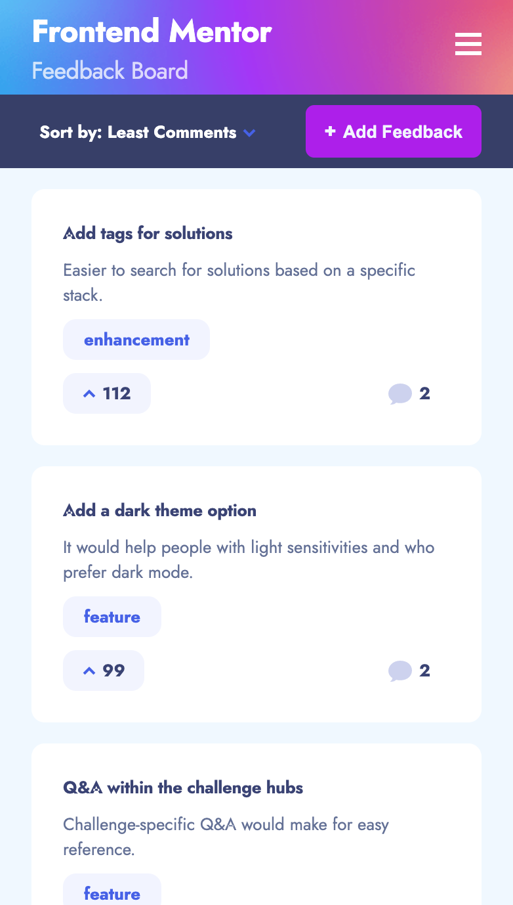
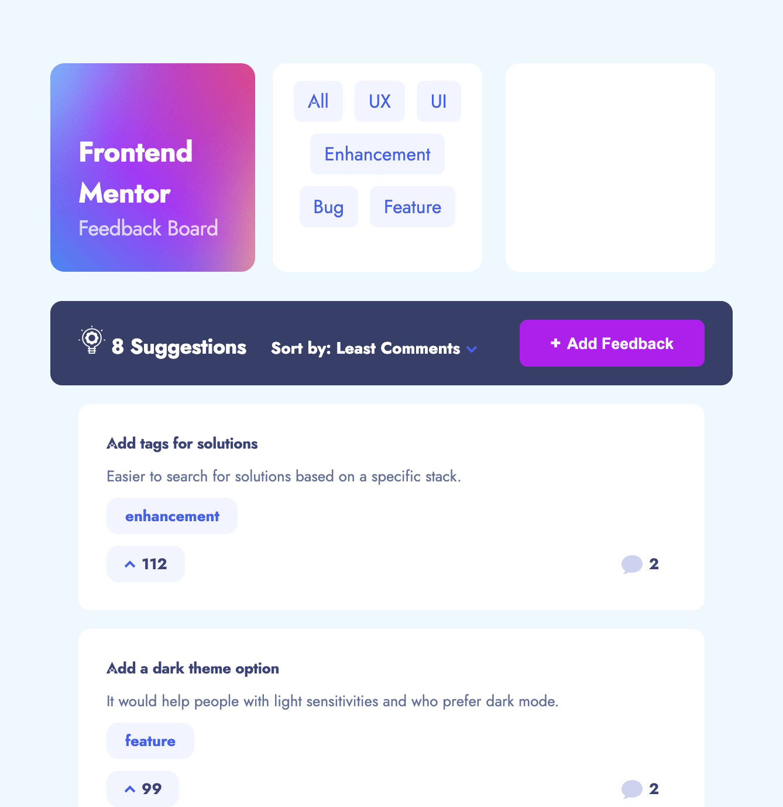
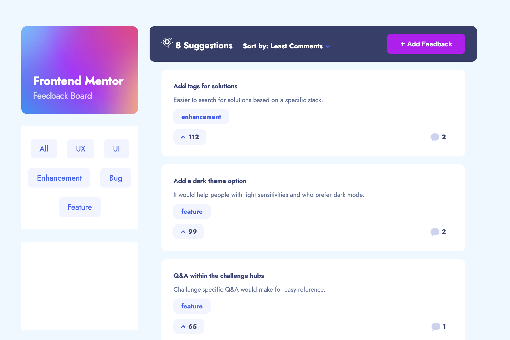

# BlackBlock

Product feedback application is responsive to different screen sizes. This application displays a list of product feedback request and allows you to create a new feedback and add it to this list. You may also order it by most/least upvote and most/least comments as well as filter by category.

---

## Behavior

- On the first load fills the content with the local data `data.json`
- Cretes a new feedback and saves it in the `localStorage`
- The data created are persistent
- On the suggestions page render only requests with a suggestion status
- Filters by five categories (UI, UX, enhancement, bug and feature)
- Sort suggestions by most/least upvotes and most/least comments

### Technologies and tools

- Create React App
- React Router
- React Hooks
- Sass
- Responsive Web Design
- Figma
- Trello (As agile methodology)

#### Installation

To run on your local

- git fork
- git clone
- npm install
- npm start

##### Project state

This project is still under construction and features are yet to be added.

- Update and delete product feedback requests
- Add comments and replies to a product feedback request
- Upvote product feedback requests
- Add Editing feedback and RoadMap page
- Create an empty page

###### Planned changes

- Use redux for the states
- Connect to a database on [PostgreSQL](https://www.postgresql.org/)
